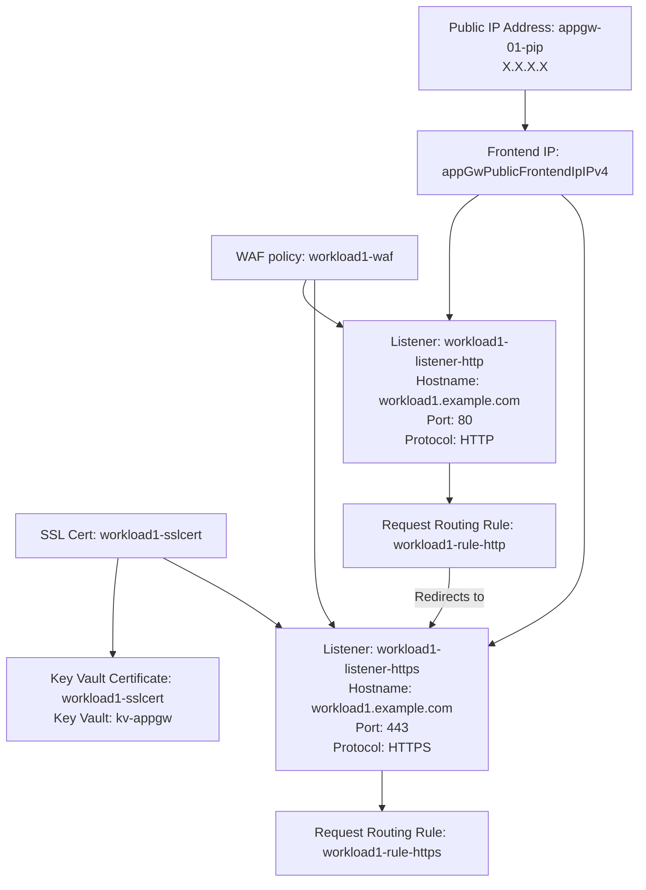
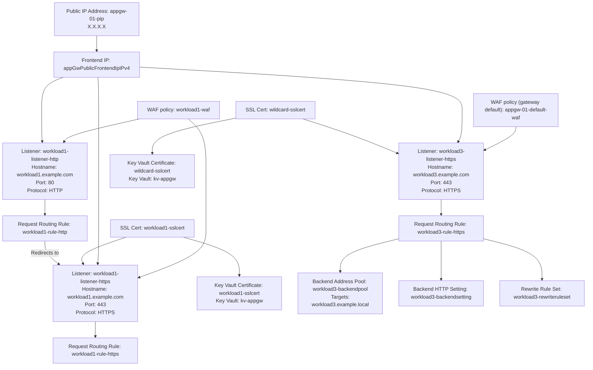

# AzAppGatewayVisualizer Powershell Module
A PowerShell module for generating [Mermaid]([url](https://mermaid.js.org/)https://mermaid.js.org/) diagrams about Azure Application Gateways. The diagrams contains information about listeners, WAF policies, request routing rules, etc.
The diagram is displaying gateway resources and their relationships for one or more hostnames.

## Requirements
- It is tested with Powershell Core (7.x) but it should work with Windows Powershell (5.x).
- Az.Network PowerShell module

## Installation
You can install the AzAppGatewayVisualizer module from the PowerShell Gallery using the following command:
```powershell
Install-Module -Name AzAppGatewayVisualizer
```

## Usage
### Get a diagram for a single hostname:
```powershell
Get-AzAppGatewayDiagram -AppGatewayName 'appgw' -ResourceGroupName 'rg-appgw' -Hostname "workload1.example.com"
```

### Get a diagram for multiple hostnames:
```powershell
Get-AzAppGatewayDiagram -AppGatewayName 'appgw' -ResourceGroupName 'rg-appgw' -Hostname "workload1.example.com", "workload3.example.com"
```


### Get a diagram for all hostnames on a gateway
Not recommended for a high number of hostnames beacuse it will cause performance issues when rendering the diagram.
```powershell
Get-AzAppGatewayDiagram -AppGatewayName 'appgw' -ResourceGroupName 'rg-appgw'
```

```mermaid
graph TB
wafpolicy_workload1-waf[WAF policy: workload1-waf] --> listener_workload1-listener-https
frontendipconfigurationappGwPublicFrontendIpIPv4[Frontend IP: appGwPublicFrontendIpIPv4] ---> listener_workload1-listener-https
listener_workload1-listener-https[Listener: workload1-listener-https<br>Hostname: workload1.example.com<br>Port: 443<br>Protocol: HTTPS]
sslcert_workload1-sslcert[SSL Cert: workload1-sslcert] --> listener_workload1-listener-https
sslcert_workload1-sslcert --> keyvaultcert_workload1-sslcert[Key Vault Certificate: workload1-sslcert<br>Key Vault: azappgatewayvisualizerkv]
listener_workload1-listener-https --> rule_workload1-rule-https[Request Routing Rule: workload1-rule-https]
wafpolicy_workload1-waf[WAF policy: workload1-waf] --> listener_workload1-listener-http
publicipaddress_appgw-01-pip[Public IP Address: appgw-01-pip<br>51.11.245.39] --> frontendipconfigurationappGwPublicFrontendIpIPv4
frontendipconfigurationappGwPublicFrontendIpIPv4[Frontend IP: appGwPublicFrontendIpIPv4] ---> listener_workload1-listener-http
listener_workload1-listener-http[Listener: workload1-listener-http<br>Hostname: workload1.example.com<br>Port: 80<br>Protocol: HTTP]
listener_workload1-listener-http --> rule_workload1-rule-http[Request Routing Rule: workload1-rule-http]
rule_workload1-rule-http -- Redirects to --> listener_workload1-listener-https
wafpolicy_workload2-waf[WAF policy: workload2-waf] --> listener_workload2-listener-https
frontendipconfigurationappGwPrivateFrontendIpIPv4[Frontend IP: appGwPrivateFrontendIpIPv4<br>Private IP: 10.0.0.10] ---> listener_workload2-listener-https
listener_workload2-listener-https[Listener: workload2-listener-https<br>Hostname: workload2.example.com<br>Port: 444<br>Protocol: HTTPS]
sslcert_wildcard-sslcert[SSL Cert: wildcard-sslcert] --> listener_workload2-listener-https
sslcert_wildcard-sslcert --> keyvaultcert_wildcard-sslcert[Key Vault Certificate: wildcard-sslcert<br>Key Vault: azappgatewayvisualizerkv]
listener_workload2-listener-https --> rule_workload2-rule-https[Request Routing Rule: workload2-rule-https]
rule_workload2-rule-https -- URL Paths: /application<br>/homepage<br>/workload3 ---> urlpathmap_workload2-rule-https_application[Path Rule: application]
urlpathmap_workload2-rule-https_application --> backendaddresspool_workload2-backendpool[Backend Address Pool: workload2-backendpool<br>Targets:<br>workload2.example.local]
urlpathmap_workload2-rule-https_application --> backendhttpsetting_default-backendsetting[Backend HTTP Setting: default-backendsetting]
rule_workload2-rule-https -- URL Paths: /application<br>/homepage<br>/workload3 ---> urlpathmap_workload2-rule-https_homepage[Path Rule: homepage]
urlpathmap_workload2-rule-https_homepage -- Redirects to --> redirectconfiguration_workload2-rule-https_homepage[External URL: https://example.com]
rule_workload2-rule-https -- URL Paths: /application<br>/homepage<br>/workload3 ---> urlpathmap_workload2-rule-https_workload3[Path Rule: workload3]
urlpathmap_workload2-rule-https_workload3 --> backendaddresspool_workload3-backendpool[Backend Address Pool: workload3-backendpool<br>Targets:<br>workload3.example.local]
urlpathmap_workload2-rule-https_workload3 --> backendhttpsetting_workload3-backendsetting[Backend HTTP Setting: workload3-backendsetting]
rule_workload2-rule-https -- Redirects to --> redirectconfiguration_workload2-rule-https[External URL: https://workload2.example.local/application]
wafpolicy_appgw-01-default-waf["WAF policy (gateway default): appgw-01-default-waf"] --> listener_workload3-listener-https
frontendipconfigurationappGwPublicFrontendIpIPv4[Frontend IP: appGwPublicFrontendIpIPv4] ---> listener_workload3-listener-https
listener_workload3-listener-https[Listener: workload3-listener-https<br>Hostname: workload3.example.com<br>Port: 443<br>Protocol: HTTPS]
sslcert_wildcard-sslcert[SSL Cert: wildcard-sslcert] --> listener_workload3-listener-https
listener_workload3-listener-https --> rule_workload3-rule-https[Request Routing Rule: workload3-rule-https]
rule_workload3-rule-https
rule_workload3-rule-https --> backendaddresspool_workload3-backendpool[Backend Address Pool: workload3-backendpool<br>Targets:<br>workload3.example.local]
rule_workload3-rule-https --> backendhttpsetting_workload3-backendsetting[Backend HTTP Setting: workload3-backendsetting]
rule_workload3-rule-https --> rewriteruleset_workload3-rewriteruleset[Rewrite Rule Set: workload3-rewriteruleset]
```

## Contributing
If you find any issues or have suggestions for improvements, feel free to open an issue or submit a pull request.

## License
This project is licensed under The MIT License - see [LICENSE](LICENSE) for details.
